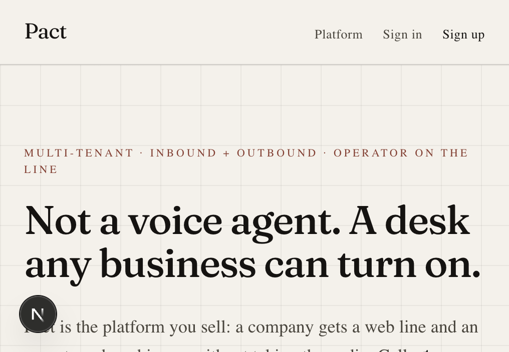
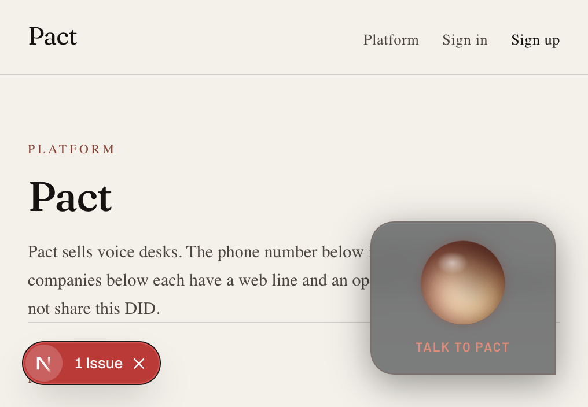
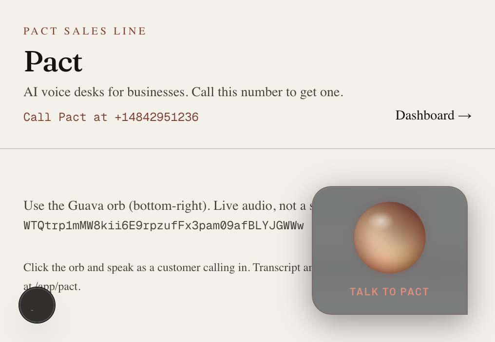
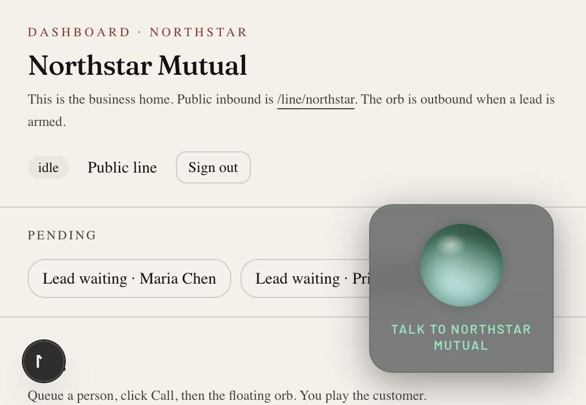

# Pact

Pact is a multi-tenant platform that sells AI voice negotiation desks to businesses.

Each customer company gets an isolated playbook, a public WebRTC line, an operator dashboard, and call records. Pact also has **its own inbound number**. Anyone who dials it is a customer of Pact — a business that wants a desk — not a caller for Northstar or Harbor.

Built for Guava Build Night SF · 29 Aug 2026.



## How it works

Two inbound paths. They must not be confused.

### Pact’s phone number

**+1 (484) 295-1236** (`+14842951236`) is bound with Guava `listen_phone` **only** to the Pact platform agent (`slug: pact`).

That agent:

- explains that Pact sells voice desks (web line + operator whisper, no transfer)
- collects company name, industry, inbound/outbound jobs, callback details
- books a follow-up, or stands up a new tenant playbook from the dump

```text
PSTN
  → +1 (484) 295-1236
  → Pact sales agent
  → qualify / callback / new desk at /line/{slug}
```

The same agent is also on `/line/pact` for people who will not dial PSTN.



### Customer tenant lines

Each tenant is a separate Guava `Agent` with its own `grtc-` WebRTC code.

```text
Web
  → /line/{slug}
  → that company’s agent (persona, greeting, tasks, DocumentQA)
  → operator at /app/{slug}
```

Demo companies:

- **Northstar Mutual** — insurance (`/line/northstar`)
- **Harbor Lane Freight** — logistics (`/line/harbor-lane`)

They do **not** share Pact’s DID. One Guava phone number can have one `listen_phone`. Unique PSTN per tenant means buying another number and pasting it on that desk.



## How Guava is used

Pact is the control plane (Next.js + Postgres). Guava is the Dialog System on the call. One Python Expert process (`expert/main.py`) holds many `Agent` objects.

| Guava primitive | Pact |
|---|---|
| `Runner.listen_webrtc(agent, grtc-code)` | Public web line per slug, including `/line/pact` |
| `Runner.listen_phone(agent, DID)` | **Only** the Pact platform agent on `+14842951236` |
| `Agent.call_phone` + `reach_person` | Tenant outbound. Caller ID may be Pact’s DID |
| `set_persona` | Tenant (or Pact) role, voice, authority |
| `set_language_mode` | English + Spanish (HITRUST) |
| `read_script` | One opening greeting |
| `set_task` + `Field` | Structured capture (sales fields on Pact, playbook fields on tenants) |
| `DocumentQA` | One namespace per slug |
| `on_escalate` → `send_instruction` | Operator whisper. **Never** `transfer()` |
| `on_caller_speech` | Transcript + fields posted to `/api/ingest` |

The Expert mints `grtc-` codes and hot-reloads on `POST /reload` when a desk is saved.



## Surfaces

| Route | What it is |
|---|---|
| `/` | Home |
| `/desks` | Platform monitor: Pact DID + sales agent, then customer desks |
| `/line/pact` | Pact sales in the browser (same agent as the phone number) |
| `/line/{slug}` | That company’s public inbound |
| `/app/pact` | Pact operator (inbound prospects) |
| `/app/{slug}` | Tenant CRM: leads, transcript, whisper |
| `/onboard` | Voice interview after a business signs up on the web |
| `/login` | Operator login |

## Demo logins

Password for all: `demo`

| Desk | Email |
|---|---|
| Northstar Mutual | `northstar@pact.local` |
| Harbor Lane Freight | `harbor@pact.local` |
| Pact platform | `pact@pact.local` |

## Run locally

```bash
# Install the Origin CLI
curl -fsSL https://downloads.cursor.com/origin/install.sh | sh
origin auth login
origin repo clone ayaan2907/guava-voice-hackathon
```

If `origin` is missing, add `~/.local/bin` to `PATH`. Docs: https://cursor.com/docs/origin/cli

```bash
cp .env.example .env   # set GUAVA_API_KEY
docker compose up -d
npm install
npm run dev
# → http://127.0.0.1:43147
```

```bash
source .venv/bin/activate
pip install -r expert/requirements.txt
python expert/main.py
# → whisper / Expert http://127.0.0.1:18766
```

`GUAVA_AGENT_NUMBER=+14842951236` is the Pact inbound DID from `guava create` (`Pact/guava.toml`). Postgres is on `localhost:5433`.

## Constraints

- One DID → one `listen_phone`. The purchased number is Pact, not every tenant.
- No three-way audio. `transfer()` would drop the agent; operators whisper with `send_instruction`.
- Do not remount the Guava widget (it kills WebRTC). One orb per `grtc-` code.
- Conversations API is post-call; the live desk is Expert ingest, not a Guava tenant API.

## Event

Guava Voice AI Hackathon Build Night SF · House of AI · 29 Aug 2026.
